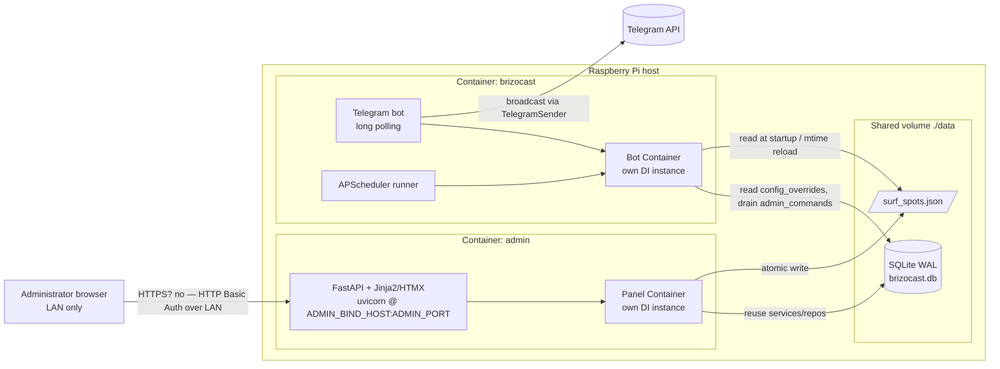
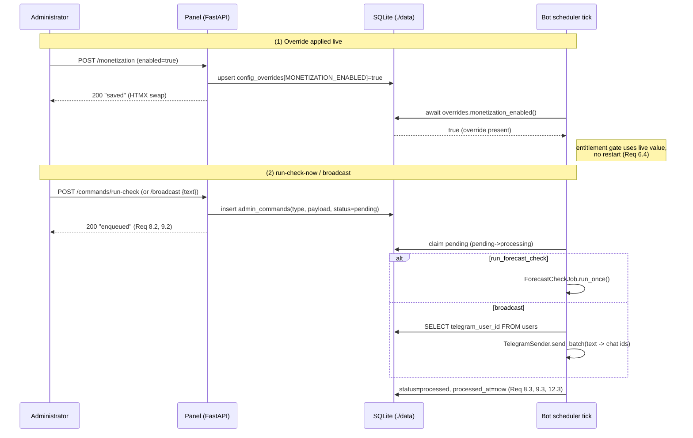

# Design Document — Admin Web Panel ("BrizoCast Admin")

## Overview

BrizoCast Admin is a server-rendered FastAPI + Jinja2/HTMX web application that runs as a
**separate Docker Compose service** in its own container, alongside the existing Telegram bot.
It shares the bot's `./data` volume — the same SQLite database
(`sqlite+aiosqlite:///data/brizocast.db`) and the surf-spot JSON dataset — and reuses the bot's
service and repository layer through its **own** `Container` instance pointed at that database.
The panel holds no in-memory state in common with the bot process.

Because the two processes have no IPC channel and the panel has no Telegram client, the two
classes of cross-process action are mediated entirely through the shared database:

- **Live configuration** (monetization flag, plan limits, forecast provider) is persisted in a
  `config_overrides` table and read by the bot at runtime through an `OverrideAwareSettings`
  accessor that resolves *override-first, else `.env`-default* on every use — so changes apply
  without restarting the bot.
- **Bot-only actions** (run-forecast-check-now, broadcast) are enqueued in an `admin_commands`
  table that the bot drains on each scheduler tick, with idempotency and per-command error
  isolation.

Security is two-layered: the container publishes its port bound to the Pi's LAN address (never
`0.0.0.0`), and every route is protected by HTTP Basic Auth using a single admin credential from
the panel's `.env`.

The design is deliberately **non-invasive** to the bot: the only bot-side changes are (1) swapping
`Settings` for an `OverrideAwareSettings` wrapper at the handful of runtime-config read sites,
(2) adding a command-queue drain step to the scheduler tick, (3) seeding/reading the surf-spot
dataset from `./data` instead of the bundled resource, and (4) persisting the scheduler-run
timestamp. New tables join the existing `Base.metadata`, so the existing bootstrap creates them.

### Detected language / stack

Python 3.12, `asyncio`, async SQLAlchemy 2.0, FastAPI, Jinja2, HTMX, Uvicorn. Code samples below
use `from __future__ import annotations` and PEP 604 / 3.12 typing, matching the codebase.

---

## Architecture

### Component diagram



The panel and bot never call each other. They rendezvous only on `DB` (config + command rows) and
`JSON` (surf spots). Each owns its own `Container`, session factory, and SQLite connections.

### Folder structure

A new package `brizocast/admin/` holds the entire web layer. Nothing under `admin/` is imported by
the bot; the dependency arrow points one way (admin → existing services/repos/models).

```
brizocast/admin/
  __init__.py
  app.py                 # FastAPI app factory: build_admin_app(settings) -> FastAPI
  __main__.py            # uvicorn entrypoint: python -m brizocast.admin
  settings.py            # PanelSettings (pydantic-settings): ADMIN_USERNAME/PASSWORD/host/port
  auth.py                # HTTP Basic Auth dependency (constant-time compare)
  dependencies.py        # build/cache the panel Container; FastAPI Depends providers
  flash.py               # tiny cookie/session flash-message + CSRF token helper
  routers/
    __init__.py
    users.py             # users list/detail, change plan
    subscriptions.py     # subscriptions list
    spots.py             # surf-spot CRUD (JSON dataset)
    presets.py           # regional default presets (DB-backed)
    monetization.py      # flag toggle + plan-limit editing (overrides)
    forecast.py          # provider switch + cache clear (override + repo)
    commands.py          # run-check-now, broadcast (enqueue)
    feedback.py          # feedback list + counts
    stats.py             # stats/health
  templates/             # Jinja2: base.html + one per page, _partials for HTMX swaps
    base.html ...
  static/                # minimal css + htmx.min.js (vendored, no CDN)

brizocast/config/
  overrides.py           # NEW: OverrideAwareSettings + ConfigOverrideStore (shared by bot + panel)

brizocast/models/
  config_override.py     # NEW: ConfigOverride model
  admin_command.py       # NEW: AdminCommand model
  scheduler_run.py       # NEW: SchedulerRun model (persist last successful run, Req 11.2)

brizocast/services/
  admin_command_service.py   # NEW: enqueue + drain queue (shared by bot + panel)
  spot_admin_service.py      # NEW: JSON dataset CRUD with atomic write + validation
  preset_admin_service.py    # NEW: DB-backed default-preset CRUD with validation
  config_admin_service.py    # NEW: write/read overrides with validation
```

The panel's only "new logic" lives in the four `*_admin_service.py` modules and the override
accessor; the routers are thin HTTP adapters over them and over the existing services
(`UserService`, `SubscriptionService`, `FeedbackService`, `ForecastService`'s cache repo, etc).

---

## Components and Interfaces

### 1. App factory, panel settings, and Container reuse

`PanelSettings` is a separate `pydantic-settings` model so the panel can boot without the bot's
required `TELEGRAM_BOT_TOKEN`, while still reading the **shared** `DATABASE_URL`.

```python
# brizocast/admin/settings.py
from __future__ import annotations
from pydantic import Field
from pydantic_settings import BaseSettings, SettingsConfigDict

class PanelSettings(BaseSettings):
    model_config = SettingsConfigDict(env_file=".env", case_sensitive=False, extra="ignore")

    ADMIN_USERNAME: str                                    # Req 13.2, 13.3
    ADMIN_PASSWORD: str                                    # Req 13.2, 13.3
    ADMIN_BIND_HOST: str = "127.0.0.1"                     # LAN host; Req 13.2, 1.5
    ADMIN_PORT: int = Field(default=8000, ge=1, le=65535)  # Req 13.2
    DATABASE_URL: str = "sqlite+aiosqlite:///data/brizocast.db"  # shared DB; Req 13.4
    SPOT_DATASET_PATH: str = "data/surf_spots.json"        # shared JSON on ./data; Req 4.*, 14.2
```

`load_panel_settings()` mirrors `config/settings.load_settings`: on a missing `ADMIN_USERNAME`/
`ADMIN_PASSWORD` it logs the offending field by name and raises `SystemExit(1)` (Req 13.3).

The app factory builds the panel's own `Container` at the shared DB and reuses the bot's
`load_settings()` for the `.env` defaults that back the override accessor.

```python
# brizocast/admin/app.py
def build_admin_app(panel: PanelSettings) -> FastAPI:
    bot_settings = load_settings()                       # the .env defaults (Req 12.2)
    engine = create_engine(panel.DATABASE_URL)           # reuse database/session.py
    session_factory = create_session_factory(engine)
    container = Container(bot_settings, session_factory=session_factory)  # Req 12.5, 13.4
    register_builtin_activities()

    app = FastAPI(title="BrizoCast Admin", dependencies=[Depends(require_admin)])  # Req 1.1
    app.state.container = container
    app.state.panel = panel
    app.state.overrides = OverrideAwareSettings(bot_settings, ConfigOverrideStore(session_factory))
    app.mount("/static", StaticFiles(directory=_static_dir()), name="static")
    for router in (users, subscriptions, spots, presets, monetization,
                   forecast, commands, feedback, stats):
        app.include_router(router.router)

    @app.on_event("startup")
    async def _startup() -> None:
        await bootstrap_database(engine)                 # creates new tables too (Req 16.4 reuse)
        await ensure_spot_dataset_seeded(panel.SPOT_DATASET_PATH)  # copy bundled JSON -> ./data once
    return app
```

`app-wide `dependencies=[Depends(require_admin)]`` applies Basic Auth to **every** route in one
place (Req 1.1), including routers added later.

### 2. Authentication and LAN binding

```python
# brizocast/admin/auth.py
import secrets
from fastapi import Depends, HTTPException, Request, status
from fastapi.security import HTTPBasic, HTTPBasicCredentials

_basic = HTTPBasic(auto_error=False)   # we craft the 401 + challenge ourselves

def require_admin(
    request: Request,
    creds: HTTPBasicCredentials | None = Depends(_basic),
) -> str:
    panel: PanelSettings = request.app.state.panel
    if creds is None:
        # Req 1.2 — no credentials: 401 + challenge.
        raise HTTPException(status.HTTP_401_UNAUTHORIZED, headers={"WWW-Authenticate": "Basic"})
    # constant-time compare of BOTH fields so neither user nor pass leaks via timing.
    user_ok = secrets.compare_digest(creds.username.encode(), panel.ADMIN_USERNAME.encode())
    pass_ok = secrets.compare_digest(creds.password.encode(), panel.ADMIN_PASSWORD.encode())
    if not (user_ok & pass_ok):
        # Req 1.3 — wrong credentials: 401.
        raise HTTPException(status.HTTP_401_UNAUTHORIZED, headers={"WWW-Authenticate": "Basic"})
    return creds.username                                 # Req 1.4 — authorized; route proceeds
```

`user_ok & pass_ok` (bitwise on bools) avoids the short-circuit of `and`, keeping the comparison
work constant regardless of which field is wrong.

LAN-only binding is enforced at two layers, not in app code:
- **Uvicorn** binds to `panel.ADMIN_BIND_HOST` (default `127.0.0.1`; set to the Pi's LAN IP in
  `.env`) — never `0.0.0.0` (Req 1.5).
- **Compose** publishes `${ADMIN_BIND_HOST}:${ADMIN_PORT}:8000`, so Docker only opens the port on
  that host interface (Req 14.3). See Deployment.

### 3. Cross-process mechanism (the crux)

#### 3a. Live configuration: `config_overrides` + `OverrideAwareSettings`

A single table stores override rows as `(key, value JSON, updated_at)`. The accessor wraps the
validated `.env` `Settings` and consults the store **first** for the three overridable keys,
falling back to the `Settings` attribute otherwise. Crucially it re-reads the store **on every
access** (no process-lifetime caching), which is what lets the bot pick up changes live (Req 6.4,
7.3, 12.2).

```python
# brizocast/config/overrides.py
OVERRIDE_KEYS = frozenset({"MONETIZATION_ENABLED", "PLAN_LIMITS", "FORECAST_PROVIDER"})

class ConfigOverrideStore:
    """Thin repository over the config_overrides table (JSON values)."""
    def __init__(self, session_factory: SessionFactory) -> None: ...
    async def get(self, key: str) -> object | None: ...          # decoded JSON or None
    async def set(self, key: str, value: object) -> None: ...    # upsert + updated_at=now
    async def all(self) -> dict[str, object]: ...

class OverrideAwareSettings:
    """Settings facade: returns a persisted override when present, else the .env default.

    Backward compatible: it exposes the same attribute surface the bot already reads
    (`MONETIZATION_ENABLED`, `PLAN_LIMITS`, `FORECAST_PROVIDER`, and every pass-through field),
    so existing call sites change only in *how they obtain* the settings object, not in how they
    use it. Override lookups are async; non-overridable attributes proxy straight to Settings.
    """
    def __init__(self, base: Settings, store: ConfigOverrideStore) -> None:
        self._base, self._store = base, store

    async def monetization_enabled(self) -> bool:
        return _coerce_bool(await self._resolve("MONETIZATION_ENABLED", self._base.MONETIZATION_ENABLED))
    async def plan_limits(self) -> dict[str, PlanLimit]:
        raw = await self._resolve("PLAN_LIMITS", None)
        return self._base.PLAN_LIMITS if raw is None else {k: PlanLimit(**v) for k, v in raw.items()}
    async def forecast_provider(self) -> str:
        return str(await self._resolve("FORECAST_PROVIDER", self._base.FORECAST_PROVIDER))

    async def _resolve(self, key: str, default: object) -> object:
        override = await self._store.get(key)             # Req 12.2 precedence
        return default if override is None else override

    def __getattr__(self, name: str) -> object:           # pass-through for non-overridable fields
        return getattr(self._base, name)
```

**Minimal, non-invasive bot wiring** — three read sites consume the accessor, re-resolving per use:

1. **Entitlement gate** (`EntitlementService`). Today it reads `self._settings.MONETIZATION_ENABLED`
   / `self._settings.PLAN_LIMITS` directly. Change: inject `OverrideAwareSettings` and call the
   async `monetization_enabled()` / `plan_limits()` inside each method (`assert_can_create_subscription`,
   `max_subscriptions_for`, `allowed_notification_modes`). Each method already opens a session, so
   adding an `await self._settings.monetization_enabled()` at the top is a localized edit (Req 6.4).
2. **Forecast provider factory / `ForecastService`**. The container's `_build_forecast_service`
   bakes the provider in at build time from `settings.FORECAST_PROVIDER`. Change: make the
   forecast provider resolved **per tick** — wrap provider selection in a small
   `ProviderSelector.current()` that calls `build_forecast_provider(cfg_with(provider=await
   overrides.forecast_provider()))`. The forecast-check job asks the selector for the live provider
   at the start of each `run_once`, so a provider switch applies on the next tick without restart
   (Req 7.3). `build_forecast_provider` already falls back safely on an unknown key.
3. **Scheduler / per-tick reads**. The scheduler tick is the natural re-resolution point; both the
   entitlement reads (via subscription creation) and the provider selection above are re-read there
   and during bot interactions, so no long-lived cached config exists.

Because `OverrideAwareSettings.__getattr__` proxies everything else to the real `Settings`, any
call site that does not need an override is unaffected — the wrapper is a drop-in.

#### 3b. Command queue: `admin_commands` drained on each tick

```python
# brizocast/services/admin_command_service.py
class AdminCommandType(StrEnum):
    RUN_FORECAST_CHECK = "run_forecast_check"
    BROADCAST = "broadcast"

class AdminCommandService:
    def __init__(self, session_factory: SessionFactory) -> None: ...

    async def enqueue(self, type_: AdminCommandType, payload: dict | None = None) -> int:
        """Insert a pending command; returns its id (panel side, Req 8.1, 9.1)."""

    async def drain(self, handlers: Mapping[AdminCommandType, CommandHandler]) -> DrainResult:
        """Process pending commands oldest-first with idempotency + per-command isolation.

        For each pending row, atomically claim it (status pending->processing guarded by a
        WHERE status='pending' UPDATE so a re-entrant drain cannot double-claim), invoke the
        handler, then set status='processed' + processed_at on success (Req 8.3, 12.3) or
        status='failed' on error — logging and continuing with the rest (Req 12.4).
        """
```

The bot wires `drain` into the scheduler. The cleanest non-invasive seam is a dedicated
`admin-command-drain` APScheduler job registered next to the existing jobs in `bot/app.py`, firing
on the same interval as the forecast check (or every minute, configurable). It is independent of
the forecast-check job so a long forecast pass never delays command pickup, and it inherits
`max_instances=1, coalesce=True` to avoid overlap.

Handlers map command types to bot capabilities the panel cannot reach:

- **`run_forecast_check`** → calls the existing `ForecastCheckJob.run_once()` once (Req 8.3). The
  job is already idempotent per its own design; the command is marked processed on return.
- **`broadcast`** → enumerates target chat ids and sends via the bot's `TelegramSender`
  (Req 9.3). **Target enumeration:** every distinct `User.telegram_user_id` in the shared DB (a
  single `SELECT telegram_user_id FROM users`), since `telegram_user_id` doubles as the chat id
  (see `SessionUserChatIdResolver`). Delivery reuses `RetryingNotificationSender.send_batch`, so a
  failed individual delivery is logged and the batch continues (existing Req 18.3 behavior); the
  command is marked processed once the batch completes.



### 4. Reused services / repositories

The routers reuse, via the panel `Container`, the existing components without duplicating logic
(Req 12.5): `UserService` and `SqlAlchemyUserRepository`/`SqlAlchemyPlanRepository` (users + plan
change), `SqlAlchemySubscriptionRepository` (subscriptions), `FeedbackService`/
`SqlAlchemyFeedbackRepository` (feedback), `SqlAlchemyForecastCacheRepository.delete_expired`-style
clear (forecast cache), and the forecast `_REGISTRY` keys (available provider ids).

---

## Data Models

### New SQLAlchemy models (join the shared `Base.metadata`)

All three import `Base` from `brizocast.models.base` and are re-exported from
`brizocast/models/__init__.py`, so `bootstrap_database` creates them with no other change. Adding
tables to an existing database bumps nothing — `create_all` is additive — but `SCHEMA_VERSION` in
`bootstrap.py` should be incremented to `2` so deployments with the old schema recreate cleanly
(the recreate-on-incompatible path is already the documented MVP strategy).

```python
# brizocast/models/config_override.py
class ConfigOverride(Base):
    __tablename__ = "config_overrides"
    key: Mapped[str] = mapped_column(String(64), primary_key=True)   # e.g. MONETIZATION_ENABLED
    value: Mapped[dict | bool | str | float | list] = mapped_column(JSON, nullable=False)
    updated_at: Mapped[datetime] = mapped_column(DateTime(timezone=True),
                                                 default=utcnow, onupdate=utcnow, nullable=False)

# brizocast/models/admin_command.py
class AdminCommandStatus(StrEnum):
    PENDING = "pending"; PROCESSING = "processing"; PROCESSED = "processed"; FAILED = "failed"

class AdminCommand(Base):
    __tablename__ = "admin_commands"
    id: Mapped[int] = mapped_column(primary_key=True)
    type: Mapped[str] = mapped_column(String(32), nullable=False)     # run_forecast_check | broadcast
    payload: Mapped[dict] = mapped_column(JSON, nullable=False, default=dict)
    status: Mapped[AdminCommandStatus] = mapped_column(
        Enum(AdminCommandStatus, native_enum=False, length=16,
             values_callable=lambda e: [m.value for m in e]),
        default=AdminCommandStatus.PENDING, index=True, nullable=False)
    created_at: Mapped[datetime] = mapped_column(DateTime(timezone=True), default=utcnow, nullable=False)
    processed_at: Mapped[datetime | None] = mapped_column(DateTime(timezone=True), nullable=True)

# brizocast/models/scheduler_run.py  (Req 11.2 cross-process visibility)
class SchedulerRun(Base):
    __tablename__ = "scheduler_runs"
    id: Mapped[int] = mapped_column(primary_key=True)                  # single-row table (id=1)
    last_success_at: Mapped[datetime | None] = mapped_column(DateTime(timezone=True), nullable=True)
```

`SchedulerRun` exists because the bot's `InMemorySchedulerState` is process-local — the panel in a
separate process cannot read it. A tiny `SqliteSchedulerState` implementing the existing
`SchedulerRunRecorder`/`SchedulerRunReader` protocols upserts/reads row `id=1`; the bot swaps its
`InMemorySchedulerState` for it (one line in `bot/app.py`), and the panel reads the same row for the
stats page. This is the minimal change to satisfy Req 11.2/11.3 across processes.

### Surf spots: JSON dataset, two writers, atomic write

The bot's `JsonSpotRepository` today reads a **bundled package resource** and caches in memory for
the instance lifetime. To make spots editable by the panel and shared via `./data`:

1. **Relocate the dataset to the volume.** Both processes point `JsonSpotRepository(dataset_path=
   SPOT_DATASET_PATH)` at `data/surf_spots.json`. On startup, `ensure_spot_dataset_seeded` copies
   the bundled resource to that path once if absent. The container's `_build_spot_repository` is
   updated to pass the path from settings (a one-line, backward-compatible change — the param
   already exists).
2. **Atomic write (`spot_admin_service.write_atomic`).** Two processes touch `./data`, so writes
   must never expose a half-written file to the bot's reader. Write to a temp file in the same
   directory then `os.replace(tmp, target)` (atomic rename on the same filesystem), under a
   coarse in-process `asyncio.Lock` on the panel side. SQLite is the source of truth for
   everything else; the JSON file is the single shared mutable artifact, and rename-based replace
   gives readers either the old or the new complete file, never a torn one.
3. **Bot freshness.** `JsonSpotRepository` gains an **mtime check**: `_load()` reloads when the
   file's mtime changed since the cached read. This makes panel spot edits visible to the bot on
   its next discovery pass without a restart (a small, optional-but-recommended enhancement; if
   omitted, spot edits apply on the next bot restart, which is acceptable for v1).

Validation lives in `spot_admin_service`: latitude ∈ [-90, 90], longitude ∈ [-180, 180] (Req 4.5),
and unique `spot_key` against the current dataset (Req 4.6) — both reject without mutating the file.

### Regional presets: DB-backed rows (decision)

**Decision: persist region default presets as rows in the existing `presets` table**
(`owner_user_id IS NULL`, `is_default=True`, `region=<name>`), and have the panel edit those rows —
rather than editing the static-in-code `_STATIC_PRESETS`.

Justification:
- The `presets` table and `PresetService` already treat persisted defaults
  (`list_defaults(region)`) as **interchangeable** with static defaults and AI-generated ones —
  same parameter shape, same table (Req 16.10 in the bot). `PresetService.list_presets` already
  merges static defaults *and* persisted defaults, and `resolve_effective_conditions` reads
  persisted presets by id. So DB-backed editable presets flow through the bot with **zero** scoring
  changes.
- Editing static-in-code presets would require code edits + redeploy for every tuning change —
  exactly what Req 5 asks to avoid ("tune defaults without editing files").
- The bundled `_STATIC_PRESETS` remain as the immutable seed/fallback (`first_default_for_region`
  guarantees a usable default always exists), so the system is robust even with an empty
  `presets` table. The panel "create/edit regional preset" simply upserts a persisted default row;
  the panel can offer "seed from static defaults" to copy the bundled values into editable rows on
  first use.

`preset_admin_service` validates min wave ≤ max wave (Req 5.4), mirroring the bot's existing
`SurfConditions` rule, and writes via `SqlAlchemyPresetRepository`.

---

## Routes / Pages

All pages are server-rendered Jinja2 extending `base.html`; **writes** use HTMX (`hx-post` /
`hx-delete`) returning partial fragments for in-place swaps. GETs are read-only; all state changes
are POST/DELETE.

| Method | Path | Purpose | Reqs |
|---|---|---|---|
| GET | `/` | dashboard → stats/health | 11.* |
| GET | `/users` | list: telegram id, plan, sub count | 2.1 |
| GET | `/users/{id}` | detail: profile, plan, subscriptions (404 if absent) | 2.2, 2.5, 3.2 |
| POST | `/users/{id}/plan` | change plan Free/Paid → confirm | 2.3, 2.4 |
| GET | `/subscriptions` | list: owner, activity, location, radius, mode | 3.1 |
| GET | `/spots` | list surf spots | 4.1 |
| POST | `/spots` | create spot (validate coords + unique id) | 4.2, 4.5, 4.6 |
| POST | `/spots/{key}` | edit spot | 4.3, 4.5 |
| DELETE | `/spots/{key}` | delete spot | 4.4 |
| GET | `/presets` | list regional default presets | 5.1 |
| POST | `/presets` | create preset (validate wave range) | 5.3, 5.4 |
| POST | `/presets/{id}` | edit preset | 5.2, 5.4 |
| GET | `/monetization` | show flag + plan limits | 6.1 |
| POST | `/monetization/flag` | set flag → override | 6.2 |
| POST | `/monetization/limits` | edit plan limits (validate ≥1) → override | 6.3, 6.5 |
| GET | `/forecast` | show provider + available ids | 7.1 |
| POST | `/forecast/provider` | select provider (validate in registry) → override | 7.2, 7.5 |
| POST | `/forecast/cache/clear` | clear forecast cache | 7.4 |
| POST | `/commands/run-check` | enqueue run-forecast-check → confirm | 8.1, 8.2 |
| POST | `/commands/broadcast` | enqueue broadcast (reject empty) → confirm | 9.1, 9.2, 9.4 |
| GET | `/feedback` | list feedback + up/down counts | 10.1, 10.2 |
| GET | `/stats` | totals + last scheduler run (or "never") | 11.1, 11.2, 11.3 |

**CSRF / POST safety.** Although Basic Auth credentials are not ambient cookies (browsers send the
`Authorization` header per request, which limits classic CSRF), the panel still defends writes: a
per-session CSRF token is issued in a signed cookie and embedded as a hidden field / `hx-headers`
on every mutating form; the write dependency rejects POST/DELETE whose token does not match. All
mutations are POST/DELETE (never GET), so they are not triggerable by simple link navigation. The
panel sets `Cache-Control: no-store` and a restrictive `Content-Security-Policy` (self only; HTMX
is vendored in `static/`, no CDN) to avoid leaking admin pages.

---

## Error Handling

- **Validation errors** (coords, duplicate id, wave range, plan limit < 1, invalid provider,
  empty broadcast) return HTTP 400 with the page re-rendered showing the specific message via the
  flash helper; the underlying store (JSON file / overrides / queue) is **left unchanged**.
- **Not found** (`/users/{id}` for an absent id) returns 404 (Req 2.5).
- **Auth failures** return 401 with `WWW-Authenticate: Basic` (Req 1.2, 1.3).
- **Command-drain failures** in the bot: each command is isolated in its own try/except; a failure
  is logged and the row marked `failed`, and the drain continues with the rest (Req 12.4) — the
  same isolation principle the forecast-check job already uses per subscription.
- **DB/JSON I/O errors** surface as a 500 with a generic message (no stack traces to the client);
  details are logged through the existing structured logger.

---

## Correctness Properties

*A property is a characteristic or behavior that should hold true across all valid executions of a
system — a formal statement about what the system should do, bridging human-readable specs and
machine-verifiable guarantees.*

### Property 1: Auth authorizes iff credentials match

*For any* username/password pair, the Basic-Auth dependency authorizes the request (allows the
route to proceed) if and only if both the username and password equal the configured
`ADMIN_USERNAME`/`ADMIN_PASSWORD`; every non-matching pair yields HTTP 401.

**Validates: Requirements 1.3, 1.4**

### Property 2: Missing credentials are challenged

*For any* request that carries no (or an unparseable) Basic-Auth `Authorization` header, the panel
responds with HTTP 401 and a `WWW-Authenticate: Basic` challenge.

**Validates: Requirements 1.2**

### Property 3: Override resolution is override-first, else `.env` default

*For any* overridable key and *for any* combination of an `.env` default value and an optionally
persisted override, `OverrideAwareSettings` resolves to the persisted override when one exists and
otherwise to the `.env` default, re-evaluated on every read so a write between two reads changes
the second read's result.

**Validates: Requirements 6.4, 7.3, 12.2**

### Property 4: Config override persist-then-read round trip

*For any* valid monetization flag, plan-limit map, or forecast-provider value written through the
config admin service, a subsequent resolution through `OverrideAwareSettings` returns an equal
value, and a forecast provider built from the resolved provider key is the selected provider.

**Validates: Requirements 6.2, 6.3, 7.2**

### Property 5: Surf-spot dataset write/read round trip

*For any* sequence of valid create, edit, and delete operations on the surf-spot dataset, reloading
the dataset after each operation reflects exactly that operation (created spot present with its
fields, edited spot updated, deleted spot absent), and the on-disk file is always a complete,
parseable JSON array (atomic replacement).

**Validates: Requirements 4.2, 4.3, 4.4**

### Property 6: Invalid coordinates are rejected without mutation

*For any* surf-spot submission whose latitude is outside [-90, 90] or whose longitude is outside
[-180, 180], the panel rejects the submission, reports the invalid coordinate, and leaves the
dataset unchanged.

**Validates: Requirements 4.5**

### Property 7: Duplicate spot identifiers are rejected without mutation

*For any* surf-spot dataset and *for any* create submission whose identifier already exists in it,
the panel rejects the submission, reports the duplicate identifier, and leaves the dataset
unchanged.

**Validates: Requirements 4.6**

### Property 8: Inverted wave range is rejected

*For any* regional-preset submission whose minimum wave height exceeds its maximum wave height, the
panel rejects the submission, reports the invalid range, and persists no preset change.

**Validates: Requirements 5.4**

### Property 9: Regional preset persist-then-read round trip

*For any* valid regional-preset parameters, creating or editing a preset and then re-reading it
returns equal parameters, and the persisted default is visible to the bot's preset resolution for
that region.

**Validates: Requirements 5.2, 5.3**

### Property 10: Plan-limit minimum subscriptions below one is rejected

*For any* plan-limit submission whose maximum number of subscriptions is less than 1, the panel
rejects the submission, reports the invalid value, and writes no override.

**Validates: Requirements 6.5**

### Property 11: Unknown forecast provider is rejected

*For any* provider identifier that is not among the available registry identifiers, the panel
rejects the selection, reports the invalid identifier, and writes no override.

**Validates: Requirements 7.5**

### Property 12: Clearing the cache empties the forecast cache

*For any* prior contents of the forecast cache, after a clear operation the forecast-cache table
contains zero entries.

**Validates: Requirements 7.4**

### Property 13: Plan change persists

*For any* user and *for any* target tier in {Free, Paid}, changing the user's plan and then
re-reading it returns the chosen tier.

**Validates: Requirements 2.3**

### Property 14: Triggering enqueues exactly one well-formed command

*For any* run-check-now trigger or broadcast submission with non-empty text, exactly one pending
`admin_commands` row is created with the correct type, and a broadcast row carries exactly the
submitted message text in its payload.

**Validates: Requirements 8.1, 9.1**

### Property 15: Empty broadcast text is rejected

*For any* broadcast submission whose message text is empty or whitespace-only, the panel rejects
the submission, requests non-empty text, and enqueues no command.

**Validates: Requirements 9.4**

### Property 16: Draining processes pending commands exactly once (idempotent)

*For any* queue of pending commands, one drain pass runs each command's handler and transitions
each successful command to `processed` (with `processed_at` set); a second drain pass over the same
queue performs no further handler invocations for already-processed commands.

**Validates: Requirements 8.3, 9.3, 12.3**

### Property 17: Command draining isolates per-command failures

*For any* queue containing a command whose handler raises, the drain logs the error, marks that
command `failed`, and still processes every other pending command in the queue.

**Validates: Requirements 12.4**

### Property 18: Feedback counts equal actual feedback

*For any* set of feedback entries, the up-count and down-count shown on the feedback view equal the
actual number of `up` and `down` entries respectively.

**Validates: Requirements 10.2**

### Property 19: Stats totals equal actual counts

*For any* database state, the stats view's total users, per-tier user counts, total subscriptions,
and total surf spots each equal the corresponding actual count, and the per-tier counts sum to the
total user count.

**Validates: Requirements 11.1**

### Property 20: User detail lists exactly that user's subscriptions

*For any* set of users and subscriptions, a user's detail view lists exactly the subscriptions
owned by that user (no more, no fewer).

**Validates: Requirements 3.2**

---

## Testing Strategy

**Dual approach.** Property tests (Hypothesis, ≥100 iterations each) cover the universal properties
above; example/edge unit tests cover rendering shapes, the 404 path (Req 2.5), the "never" empty
state (Req 11.3), and startup-validation failures (Req 13.3). Integration/smoke tests cover the
deployment wiring (Req 1.1 dependency coverage, 1.5/1.6 config, 14.* compose) and a 1–2 example
end-to-end broadcast against a fake `TelegramSender`.

**Property test config.** Minimum 100 iterations per property; each test tagged
`Feature: admin-web-panel, Property {n}: {text}`. The cross-process accessor and queue properties
run against an in-memory/temp SQLite database with the real repositories (cheap, deterministic);
the broadcast handler uses a fake sender so no real Telegram calls are made.

**What is NOT property-tested** (per the PBT guidance): Basic-Auth-on-every-route wiring (1.1),
LAN bind/config loading (1.5, 1.6, 13.1–13.4), and Docker compose layout (14.*) are
configuration/integration concerns verified by example/smoke tests, not input-varying logic.

---

## Deployment (Docker)

### New Compose service

```yaml
# docker-compose.yml — add alongside the existing `brizocast` service
  admin:
    build: .                      # same image as the bot
    image: brizocast:latest
    container_name: brizocast-admin
    restart: unless-stopped
    env_file: .env
    command: ["python", "-m", "brizocast.admin"]   # uvicorn entrypoint (separate process)
    volumes:
      - ./data:/app/data          # SAME shared volume as the bot (Req 14.2)
    ports:
      # Bind-publish to the LAN host only — never 0.0.0.0 (Req 14.3, 1.5).
      - "${ADMIN_BIND_HOST}:${ADMIN_PORT}:8000"
    depends_on:
      - brizocast
```

`brizocast/admin/__main__.py` runs `uvicorn.run(build_admin_app(load_panel_settings()),
host=panel.ADMIN_BIND_HOST, port=8000)`. Inside the container the app listens on `8000`; Docker
publishes it only on `${ADMIN_BIND_HOST}` (the Pi's LAN IP) at `${ADMIN_PORT}`. The bot service is
unchanged and still publishes no ports (long polling, outbound only). The two are distinct
containers / processes with no shared memory (Req 14.1, 14.4).

### `.env` additions

```dotenv
# === Admin Web Panel ========================================================
ADMIN_USERNAME=admin                 # REQUIRED — startup aborts if missing (Req 13.3)
ADMIN_PASSWORD=change-me-strong      # REQUIRED — startup aborts if missing (Req 13.3)
ADMIN_BIND_HOST=192.168.1.50         # Pi LAN IP; never 0.0.0.0 (Req 1.5, 14.3)
ADMIN_PORT=8080                      # published LAN port
# SPOT_DATASET_PATH=data/surf_spots.json  # optional override of shared spots file
```

---

## Requirements Coverage Mapping

| Requirement | Covered by |
|---|---|
| 1 Auth & LAN-only | `auth.require_admin` app-wide dependency (1.1–1.4, 1.6); uvicorn `ADMIN_BIND_HOST` + compose bind-publish (1.5); Properties 1–2 |
| 2 Users & plan management | `users` router + `UserService`/plan repo; 404 path; Property 13 |
| 3 Subscriptions view | `subscriptions` router + subscription repo; Property 20 |
| 4 Surf spot management | `spot_admin_service` JSON CRUD + atomic write + validation; relocate dataset to `./data`; Properties 5–7 |
| 5 Regional preset management | DB-backed default presets via `preset_admin_service`/`SqlAlchemyPresetRepository`; Properties 8–9 |
| 6 Monetization toggle + limits (live) | `config_admin_service` overrides + `OverrideAwareSettings` in entitlement gate; Properties 3, 4, 10 |
| 7 Forecast provider + cache (live) | provider override + per-tick `ProviderSelector`; cache clear via forecast-cache repo; Properties 3, 4, 11, 12 |
| 8 Run-check-now | `AdminCommandService.enqueue` + bot drain → `ForecastCheckJob.run_once`; Properties 14, 16 |
| 9 Broadcast | enqueue broadcast + bot drain → enumerate `users.telegram_user_id` → `TelegramSender`; Properties 14, 15, 16 |
| 10 Feedback view | `feedback` router + `FeedbackService`; Property 18 |
| 11 Stats & health | `stats` router aggregations + persisted `SchedulerRun`; Property 19; "never" edge |
| 12 Cross-process mechanism | `config_overrides` + `OverrideAwareSettings`; `admin_commands` drain with idempotency + isolation; repository reuse; Properties 3, 16, 17 |
| 13 Panel configuration | `PanelSettings` + `load_panel_settings` (abort + name missing field); Container at shared DB |
| 14 Dockerized separate LAN-bound service | new `admin` compose service, shared `./data`, bind-published port, separate process |

---

## Milestone note (pragmatic v1)

1. **Foundations** — new models (`config_override`, `admin_command`, `scheduler_run`), bump
   `SCHEMA_VERSION`, `OverrideAwareSettings` + store, `AdminCommandService`, `SqliteSchedulerState`.
2. **Bot integration (non-invasive)** — wire `OverrideAwareSettings` into the entitlement gate and
   the per-tick provider selector; add the command-drain scheduler job and the broadcast/run-check
   handlers; swap `InMemorySchedulerState` → `SqliteSchedulerState`; relocate the spot dataset to
   `./data` with mtime reload.
3. **Panel app** — app factory, `PanelSettings`, Basic-Auth dependency, base templates + HTMX,
   read views (users, subscriptions, feedback, stats).
4. **Panel writes** — plan change, surf-spot CRUD, regional presets, monetization, forecast
   settings, run-check-now, broadcast — each behind CSRF-guarded POST/DELETE.
5. **Deployment** — compose `admin` service, `.env` additions, smoke + property test suites.
