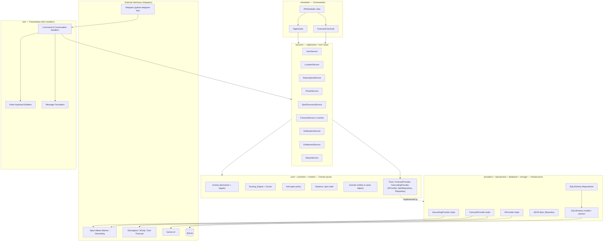
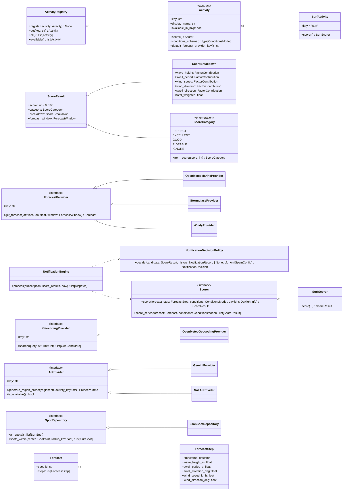
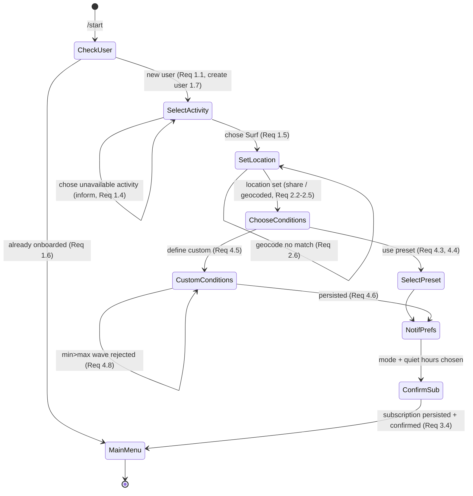
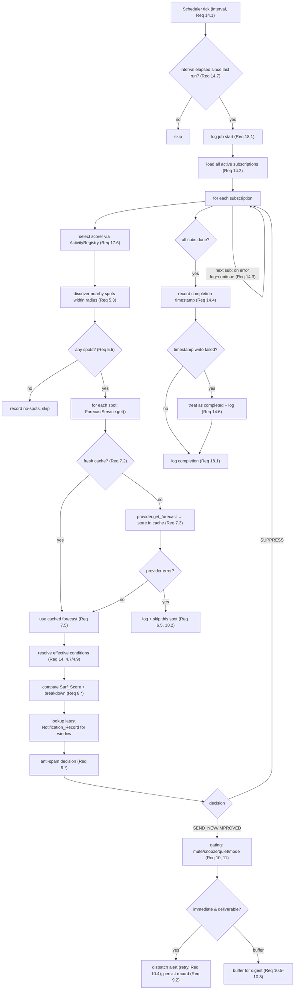

# Design Document: BrizoCast — Outdoor Conditions Alert Bot

## Overview

BrizoCast is a production-ready Telegram bot that monitors outdoor sport conditions and sends smart, low-noise notifications when conditions are favorable. The MVP implements the **Surf** activity end-to-end, but every layer is designed around a common `Activity` abstraction so that future sports (Snowboard, Kite, Wingfoil, Hiking, Climbing) can be added without modifying existing code.

The system follows **Clean Architecture** with strict dependency direction: the Telegram-facing layer (the *Bot*) and the persistence layer depend inward on the domain and service layers, never the reverse. Business logic has **no dependency on Telegram, SQLAlchemy, or any external provider** — those are reached only through interfaces (ports) resolved by a dependency-injection container at composition time.

A background **Scheduler** (APScheduler) runs a periodic forecast-check job that, for every subscription, discovers nearby surf spots, retrieves forecasts through a pluggable `ForecastProvider` (cached per spot with a TTL), computes a 0-100 surf score through an isolated weighted `Scorer`, compares the score against notification history, and dispatches notifications subject to anti-spam, digest, quiet-hours, mute/snooze, and feedback rules.

Two cross-cutting concerns are designed in from day one without affecting MVP behavior:

- **AI-assisted preset generation** through an `AIProvider` interface (Gemini default), fully optional and configurable, with a static-preset fallback when disabled or unkeyed.
- **Monetization readiness** through a `Plan`/`Membership` concept distinct from the surf `Subscription`, a reserved `Payment_Record` table, and configuration-driven feature gating behind a `MONETIZATION_ENABLED` flag. While disabled, every user has full access and gating logic is a no-op.

### Design Goals

| Goal | How the design achieves it |
|------|----------------------------|
| Swap forecast/geocoding/AI sources without touching business logic | Provider abstractions (ports) + factory selection from config |
| Add new sports without modifying existing code | `Activity` registry; per-activity `Scorer`, condition schema, provider binding |
| Run reliably on a Raspberry Pi | Per-spot TTL forecast cache, SQLite, small footprint, resilient error handling, ARM-compatible Docker image |
| Keep notifications meaningful | Score-based gating, anti-spam by forecast window, significant-improvement threshold, digests, quiet hours, mute/snooze |
| Be monetization-ready without redesign | `Plan` model + `EntitlementService` gate, all config-driven, isolated from MVP logic |
| Testability | Pure scoring/anti-spam/distance functions, repository pattern, DI, property-based + unit tests |

### Technology Stack

- **Language/Runtime:** Python 3.12+, fully type-annotated (`mypy --strict` target)
- **Telegram:** `python-telegram-bot` (v21+, async)
- **Persistence:** SQLAlchemy 2.x ORM over SQLite (WAL mode); Alembic for migrations
- **Scheduling:** APScheduler (AsyncIOScheduler)
- **Validation/Config:** Pydantic v2 + `pydantic-settings`
- **HTTP:** `httpx` (async) for provider calls
- **AI (optional):** `google-generativeai` (Gemini)
- **Packaging/Deploy:** Docker + Docker Compose, ARM/Raspberry Pi compatible, persistent SQLite volume
- **Testing:** `pytest`, `hypothesis` (property-based), `pytest-asyncio`

## Architecture

### Layered (Clean) Architecture

Dependencies point inward. The domain core knows nothing about Telegram, SQLAlchemy, HTTP, or APScheduler.



**Dependency rule:** arrows from outer layers point inward. `services/` depend on `core/` ports (interfaces). `providers/` and `repositories/` *implement* those ports. The composition root (`core/container.py` + `bot/app.py`) wires concrete implementations to ports at startup — this is the only place that knows about all layers.

### Module / Folder Structure

```
brizocast/
├── bot/                      # Presentation layer — THIN Telegram adapters only
│   ├── app.py                # Application bootstrap / composition root entry
│   ├── handlers/
│   │   ├── start.py          # /start onboarding handler
│   │   ├── location.py       # /location flow
│   │   ├── subscriptions.py  # /subscriptions, /add, /remove
│   │   ├── settings.py       # /settings (notif mode, quiet hours, mute/snooze)
│   │   ├── presets.py        # /presets
│   │   ├── status.py         # /status, /forecast
│   │   ├── feedback.py       # 👍/👎 callback handlers
│   │   └── help.py           # /help, unknown-command fallback
│   ├── conversations/        # ConversationHandler state machines (onboarding, add-sub, custom-conditions)
│   ├── keyboards/            # Inline keyboard builders (pure functions)
│   └── formatters/           # Domain -> Telegram message text (pure functions)
│
├── core/                     # Domain core — pure, framework-free
│   ├── container.py          # DI container / composition wiring
│   ├── ports/                # Interfaces (abstract base classes / Protocols)
│   │   ├── forecast_provider.py
│   │   ├── geocoding_provider.py
│   │   ├── ai_provider.py
│   │   ├── spot_repository.py
│   │   ├── scorer.py
│   │   └── repositories.py   # *Repository protocols
│   ├── domain/               # Value objects & domain logic (no I/O)
│   │   ├── geo.py            # haversine distance, bearing
│   │   ├── scoring.py        # ScoringEngine, ScoreCategory, ScoreBreakdown
│   │   ├── antispam.py       # NotificationDecisionPolicy (pure)
│   │   └── daylight.py       # sunrise/sunset calculation
│   └── errors.py             # Domain exception hierarchy
│
├── activities/               # Per-activity plug-ins (Activity abstraction)
│   ├── base.py               # Activity ABC, ActivityRegistry
│   ├── registry.py           # register()/get()/all() — open for extension
│   └── surf/
│       ├── activity.py       # SurfActivity (implements Activity)
│       ├── scorer.py         # SurfScorer (implements Scorer)
│       ├── conditions.py     # SurfConditions schema (Pydantic)
│       └── presets.py        # bundled static Default_Presets per region
│
├── providers/                # Infrastructure adapters for external data
│   ├── forecast/
│   │   ├── open_meteo_marine.py   # default
│   │   ├── stormglass.py          # pluggable
│   │   ├── windy.py               # pluggable
│   │   └── factory.py
│   ├── geocoding/
│   │   ├── open_meteo_geocoding.py # default
│   │   └── factory.py
│   └── ai/
│       ├── gemini.py              # default AIProvider
│       ├── null_ai.py             # disabled / fallback no-op
│       └── factory.py
│
├── notifications/            # Notification engine domain + dispatch policy
│   ├── engine.py             # NotificationEngine orchestration
│   ├── modes.py              # immediate / morning / evening / weekly logic
│   ├── window.py             # forecast-window identity helpers
│   └── sender.py             # Telegram delivery + retry (port impl)
│
├── scheduler/
│   ├── runner.py             # APScheduler setup, interval guard
│   ├── forecast_check_job.py # the periodic job
│   └── digest_jobs.py        # morning/evening/weekly digest jobs
│
├── services/                 # Application services / use cases
│   ├── user_service.py
│   ├── location_service.py
│   ├── subscription_service.py
│   ├── preset_service.py
│   ├── spot_discovery_service.py
│   ├── forecast_service.py   # wraps provider + Forecast_Cache
│   ├── notification_service.py
│   ├── entitlement_service.py
│   └── status_service.py
│
├── repositories/             # SQLAlchemy repository implementations
│   ├── base.py
│   ├── user_repo.py
│   ├── location_repo.py
│   ├── subscription_repo.py
│   ├── preset_repo.py
│   ├── condition_repo.py
│   ├── notification_repo.py
│   ├── feedback_repo.py
│   ├── plan_repo.py
│   ├── payment_repo.py
│   └── forecast_cache_repo.py
│
├── models/                   # SQLAlchemy ORM models (DB schema)
│   ├── base.py               # DeclarativeBase, mixins (timestamps)
│   ├── user.py  location.py  subscription.py  activity.py
│   ├── preset.py  custom_condition.py  notification.py  feedback.py
│   ├── surf_spot.py  forecast_cache.py  plan.py  payment.py
│
├── database/
│   ├── session.py            # engine, session factory, WAL pragma
│   ├── bootstrap.py          # create-if-absent / migrate
│   └── migrations/           # Alembic
│
├── storage/
│   └── spots/surf_spots.json # JSON-backed Spot_Repository dataset (MVP)
│
├── config/
│   └── settings.py           # Pydantic Settings (.env loader + validation)
│
├── tests/
│   ├── unit/                 # example & edge-case tests
│   ├── property/             # hypothesis property-based tests
│   └── integration/          # provider/repo/scheduler integration tests
│
├── Dockerfile
├── docker-compose.yml
├── .env.example
└── pyproject.toml
```

### Key Architectural Decisions and Rationale

1. **Ports & adapters for every external dependency.** Forecast, geocoding, AI, spots, and persistence are all behind interfaces in `core/ports`. The `Scoring_Engine` and `Notification_Engine` depend only on domain value objects, never on a provider. This satisfies the "swap without changing business logic" requirements (6.6, 17.3, 19.10) and makes the core unit-testable with fakes.

2. **Activity registry pattern (open/closed).** `activities/registry.py` maps an activity key to an `Activity` object carrying its `Scorer`, condition schema, and provider binding. The scheduler, scoring engine, and subscription flow look the activity up by key; adding a sport means adding a package under `activities/` and calling `register()` — no edits to existing code (Req 17).

3. **Pure domain logic isolated from I/O.** Scoring, anti-spam decision, geo distance, and daylight are pure functions in `core/domain`. This makes them deterministic, property-testable, and reusable across modes. (Req 8.9)

4. **Per-spot TTL forecast cache shared across subscriptions.** `ForecastService` checks the cache keyed by spot id before calling a provider, dramatically reducing provider load on a Pi (Req 7).

5. **Thin Telegram handlers.** Handlers parse input, call a service, and format a reply. No business rules live in `bot/`. This keeps Telegram swappable and the logic testable headlessly (Req 17, general SOLID).

6. **Monetization gate as a decorator/guard, not woven into features.** `EntitlementService` is consulted at the subscription-creation boundary only; when `MONETIZATION_ENABLED` is false it returns "unlimited". MVP feature code is untouched (Req 21.6).

## Components and Interfaces

This section specifies the ports (interfaces), domain components, and services. Signatures are given as Python type-annotated stubs; pseudocode is provided where the algorithm matters. **No full implementations are included by design** — this is an architecture document.

### Class Diagram (Domain & Ports)



### Domain Value Objects (`core/domain`, `models` mirror DB)

```python
# Pydantic models / dataclasses — pure, no I/O
class GeoPoint(BaseModel):
    lat: float  # -90..90
    lon: float  # -180..180

class GeoCandidate(BaseModel):
    name: str
    lat: float
    lon: float
    city: str | None
    country: str | None

class ForecastWindow(BaseModel):
    start: datetime
    end: datetime
    # Identity used for anti-spam dedup (see notifications/window.py)
    def key(self) -> str: ...   # e.g. "2025-06-01T06:00Z/3h"

class ForecastStep(BaseModel):
    timestamp: datetime
    wave_height_m: float
    swell_period_s: float
    swell_direction_deg: float   # 0..360
    wind_speed_kmh: float
    wind_direction_deg: float     # 0..360

class Forecast(BaseModel):
    spot_id: str
    steps: list[ForecastStep]
```

### Ports (Interfaces)

```python
# core/ports/forecast_provider.py
class ForecastProvider(Protocol):
    key: str
    async def get_forecast(self, lat: float, lon: float,
                           window: ForecastWindow) -> Forecast: ...

# core/ports/geocoding_provider.py
class GeocodingProvider(Protocol):
    key: str
    async def search(self, query: str, limit: int = 5) -> list[GeoCandidate]: ...

# core/ports/ai_provider.py
class AIProvider(Protocol):
    key: str
    def is_available(self) -> bool: ...
    async def generate_region_preset(self, region: str,
                                     activity_key: str) -> PresetParams: ...

# core/ports/spot_repository.py
class SpotRepository(Protocol):
    def all_spots(self) -> list[SurfSpot]: ...
    def spots_within(self, center: GeoPoint, radius_km: float) -> list[SurfSpot]: ...

# core/ports/scorer.py
class Scorer(Protocol):
    def score(self, step: ForecastStep, conditions: ConditionsModel,
              daylight: DaylightInfo) -> ScoreResult: ...
    def score_series(self, forecast: Forecast,
                     conditions: ConditionsModel) -> list[ScoreResult]: ...
```

Repository protocols (in `core/ports/repositories.py`) follow the same shape, e.g.:

```python
class SubscriptionRepository(Protocol):
    async def add(self, sub: SubscriptionEntity) -> SubscriptionEntity: ...
    async def get(self, sub_id: int) -> SubscriptionEntity | None: ...
    async def list_for_user(self, user_id: int) -> list[SubscriptionEntity]: ...
    async def list_all_active(self) -> list[SubscriptionEntity]: ...
    async def update(self, sub: SubscriptionEntity) -> None: ...
    async def delete(self, sub_id: int) -> None: ...
    async def count_for_user(self, user_id: int) -> int: ...
```

### The Activity Abstraction (Multi-Sport Extensibility)

```python
# activities/base.py
class Activity(ABC):
    key: ClassVar[str]                  # "surf", "snowboard", ...
    display_name: ClassVar[str]
    available_in_mvp: ClassVar[bool]

    @abstractmethod
    def scorer(self) -> Scorer: ...
    @abstractmethod
    def conditions_schema(self) -> type[ConditionsModel]: ...
    @abstractmethod
    def default_forecast_provider_key(self) -> str: ...

# activities/registry.py
class ActivityRegistry:
    _items: dict[str, Activity] = {}
    @classmethod
    def register(cls, activity: Activity) -> None: ...   # open for extension
    @classmethod
    def get(cls, key: str) -> Activity: ...
    @classmethod
    def all(cls) -> list[Activity]: ...
    @classmethod
    def available(cls) -> list[Activity]: ...             # available_in_mvp == True

# activities/surf/activity.py
class SurfActivity(Activity):
    key = "surf"; display_name = "🏄 Surf"; available_in_mvp = True
    def scorer(self) -> Scorer: return SurfScorer()
    def conditions_schema(self) -> type[ConditionsModel]: return SurfConditions
    def default_forecast_provider_key(self) -> str: return "open_meteo_marine"
```

Adding **Snowboard** later: create `activities/snowboard/` with a `SnowboardActivity`, `SnowboardScorer`, and `SnowboardConditions` (which may define entirely different parameters — fresh snowfall, base depth, temperature), then `ActivityRegistry.register(SnowboardActivity())`. The scheduler selects the scorer via `ActivityRegistry.get(sub.activity_key).scorer()`. No existing file changes. (Req 17.1-17.6)

### Forecast Provider Abstraction

- `OpenMeteoMarineProvider` is the default (Req 6.2). It calls the Open-Meteo Marine + Weather APIs (no API key), maps the response to `Forecast`/`ForecastStep`.
- `StormglassProvider`, `WindyProvider`, `SurfForecastProvider` are pluggable stubs implementing the same interface; selected by `FORECAST_PROVIDER` config (Req 6.3).
- `providers/forecast/factory.py` resolves the key to an implementation; unknown/empty → default (Req 15.5).
- On network failure, the provider raises `ProviderRequestError`; `ForecastService` logs it and skips the affected spot for that run (Req 6.5, 18.2).

### Geocoding Provider Abstraction

- `OpenMeteoGeocodingProvider` is default (Req 2.3). `search()` returns candidate `GeoCandidate`s. Zero candidates → empty list (handler asks for a new term, Req 2.6). Request failure raises `ProviderRequestError`, surfaced to the user as "temporarily unavailable" and logged (Req 2.11, 18.2).

### AI Provider Abstraction (Optional Preset Generation)

```python
# providers/ai/factory.py
def build_ai_provider(cfg: Settings) -> AIProvider:
    if not cfg.AI_ENABLED:
        return NullAIProvider()                 # is_available() -> False
    if not cfg.AI_API_KEY:
        return NullAIProvider()                 # enabled but unkeyed -> fallback
    key = cfg.AI_PROVIDER or "gemini"           # default Gemini (Req 19.2, 15.7)
    return {"gemini": GeminiProvider}[key](cfg.AI_API_KEY, cfg.AI_MODEL)
```

`PresetService.get_region_presets(region, activity_key)`:

```
presets = static_presets(region, activity_key)            # always available
if ai_provider.is_available():
    try:
        ai_preset = await ai_provider.generate_region_preset(region, activity_key)
        presets = [ai_preset] + presets        # interchangeable shape (Req 19.5, 16.10)
    except ProviderRequestError as e:
        log.warning("AI preset gen failed, using static", provider=ai_provider.key, err=e)
        # fall back silently (Req 19.8, 19.9)
return presets
```

`generate_region_preset` returns `PresetParams` with the **exact same shape** as a static preset (min/max wave height, min period, max wind, preferred wind dir, preferred swell dir), so AI presets persist in the same `presets` table and are interchangeable everywhere (Req 19.4, 19.5, 16.10). The `Scoring_Engine`/`Notification_Engine`/`ForecastProvider` never reference the AI provider (Req 19.10).

### Surf Scoring Engine (Weighted, 0-100)

The scorer is a **weighted scoring engine**, not a pass/fail threshold check (Req 8.7). Each factor produces a normalized sub-score in `[0,1]`; sub-scores are combined with configurable weights and scaled to `0-100`.

```python
# activities/surf/scorer.py  (pseudocode of the algorithm)
WEIGHTS = {  # sum == 1.0; tunable via config / future feedback
    "wave_height":    0.30,
    "swell_period":   0.25,
    "wind_speed":     0.20,
    "wind_direction": 0.15,
    "swell_direction":0.10,
}

def score(step, c: SurfConditions, daylight) -> ScoreResult:
    # 1. Daylight gate (Req 8.8)
    if c.daylight_only and not daylight.is_daylight(step.timestamp):
        return ScoreResult(score=0, category=IGNORE, breakdown=zeroed(), window=...)

    # 2. Per-factor normalized sub-scores in [0,1]
    f_wave  = wave_height_curve(step.wave_height_m, c.min_wave_m, c.max_wave_m)
    f_per   = period_curve(step.swell_period_s, c.min_period_s)
    f_wind  = wind_speed_curve(step.wind_speed_kmh, c.max_wind_kmh)
    f_wdir  = direction_match(step.wind_direction_deg, c.preferred_wind_dir)   # offshore favored
    f_sdir  = direction_match(step.swell_direction_deg, c.preferred_swell_dir)

    # 3. Weighted combine -> 0..100, clamped & rounded to int
    total = sum(WEIGHTS[k] * f for k, f in factors.items())
    score = clamp(round(total * 100), 0, 100)

    breakdown = ScoreBreakdown(
        wave_height=FactorContribution(f_wave, WEIGHTS["wave_height"]),
        swell_period=FactorContribution(f_per, WEIGHTS["swell_period"]),
        wind_speed=FactorContribution(f_wind, WEIGHTS["wind_speed"]),
        wind_direction=FactorContribution(f_wdir, WEIGHTS["wind_direction"]),
        swell_direction=FactorContribution(f_sdir, WEIGHTS["swell_direction"]),
        total_weighted=total)
    return ScoreResult(score, ScoreCategory.from_score(score), breakdown, window)
```

- **Factor curves** (`wave_height_curve`, etc.) are pure helpers returning `[0,1]`. Wave height uses a plateau between `min` and `max` and falls off outside; wind speed decays as it approaches/exceeds `max_wind`; direction matching uses angular distance to the preferred bearing.
- `ScoreCategory.from_score` implements the exact bands: Perfect 95-100, Excellent 85-94, Good 70-84, Rideable 50-69, Ignore <50 (Req 8.2-8.6).
- The scorer lives in its own module with no imports from forecast retrieval, notification, or persistence (Req 8.9), and exposes the per-factor breakdown for explainable alerts (Req 8.11, 12.2).
- **Extensibility:** `score_series` iterates steps; other activities provide their own `Scorer` selected via the registry (Req 8.10, 17.6).

### Notification Engine (Anti-Spam, Modes, Quiet Hours, Mute/Snooze, Feedback)

The decision logic is a **pure policy** so it is property-testable; dispatch (Telegram send + retry) is a separate adapter.

```python
# core/domain/antispam.py
class NotificationDecision(Enum): SEND_NEW; SEND_IMPROVED; SUPPRESS

def decide(candidate: ScoreResult,
           last: NotificationRecord | None,
           cfg: AntiSpamConfig) -> NotificationDecision:
    if candidate.category < ScoreCategory.RIDEABLE:        # below Rideable (Req 9.1)
        return SUPPRESS
    if last is None:
        return SEND_NEW                                     # first qualifying alert (Req 9.2)
    if candidate.score <= last.score:                       # equal/lower (Req 9.3)
        return SUPPRESS
    if candidate.score - last.score < cfg.significant_improvement:   # not enough (Req 9.4)
        return SUPPRESS
    return SEND_IMPROVED                                     # >= threshold (Req 9.5)
```

`NotificationEngine.process(subscription, score_results, now)`:

```
1. If subscription muted -> [] (Req 11.3) unless command path (/forecast bypasses, Req 13.4)
2. If snoozed and now < snooze_until -> [] (Req 11.4)
3. For each score_result (best per spot/window):
   a. last = notification_repo.latest(sub_id, spot_id, window.key())
   b. decision = antispam.decide(score_result, last, cfg)
   c. if decision == SUPPRESS: continue
   d. if mode == IMMEDIATE:
        if within quiet hours(now) -> defer to next digest queue (Req 11.2, 10.3)
        else enqueue Dispatch(now)
      else: buffer for the relevant digest (Req 10.5-10.7)
4. Return dispatch list; caller persists NotificationRecord on successful send (Req 9.2)
```

- **Modes** (`notifications/modes.py`): immediate, morning digest, evening digest, weekly best day. Digest jobs run on their own APScheduler triggers, gather qualifying records since the last digest, and skip sending when empty (Req 10.8).
- **Immediate retry/fallback:** `sender.py` retries up to `NOTIFY_RETRY_COUNT`; on exhaustion the alert is added to the subscription's next digest (Req 10.4).
- **Quiet hours / mute / snooze** are evaluated as guards before dispatch (Req 11). Mute persists until unmute even after snooze elapses (Req 11.6).
- **Explainable alert** message (formatter) includes score, category, spot name, forecast window, and the wave/period/wind breakdown, plus inline 👍/👎 controls (Req 12.1-12.3). Feedback callbacks persist to the `feedback` table associated with subscription, spot, and score (Req 12.4-12.5).

### Service Layer

| Service | Responsibility | Key requirements |
|---------|----------------|------------------|
| `UserService` | Create/lookup user by Telegram id; assign Free Plan on creation | 1.7, 20.3 |
| `LocationService` | Create locations (shared point / geocoded), manage favorites | 2.* |
| `SubscriptionService` | CRUD subscriptions, radius validation (1-200, default 30), require location | 3.* |
| `PresetService` | List static + AI presets, resolve default, persist custom conditions | 4.*, 19.*, 16.10 |
| `SpotDiscoveryService` | Discover spots within radius via `SpotRepository` | 5.* |
| `ForecastService` | Provider call wrapped by `Forecast_Cache` (TTL, shared) | 6.*, 7.* |
| `NotificationService` | Apply engine decisions, persist records, dispatch | 9.*, 10.*, 11.*, 12.* |
| `EntitlementService` | Resolve entitlements from plan + limits; gate creation/modes | 21.* |
| `StatusService` | Active sub count, last scheduler run, on-demand best forecast | 13.3, 13.4 |

`ForecastService.get(spot)` (cache logic, Req 7):

```
rec = cache_repo.get(spot.id)
if rec and (now - rec.fetched_at) < TTL:        # non-expired (Req 7.2, 7.4)
    return rec.forecast                          # shared across subs (Req 7.5)
forecast = await provider.get_forecast(spot.lat, spot.lon, window)   # (Req 7.3)
cache_repo.put(spot.id, forecast, fetched_at=now)
return forecast
```

### Entitlement / Monetization Gate (isolated)

```python
# services/entitlement_service.py
def max_subscriptions(self, user) -> int | float:
    if not self.cfg.MONETIZATION_ENABLED:
        return math.inf                          # full access (Req 21.2)
    return self.cfg.PLAN_LIMITS[user.plan.tier].max_subscriptions

def allowed_notification_modes(self, user) -> set[NotificationMode]:
    if not self.cfg.MONETIZATION_ENABLED:
        return set(NotificationMode)             # all modes
    return self.cfg.PLAN_LIMITS[user.plan.tier].notification_modes

def assert_can_create_subscription(self, user) -> None:
    if not self.cfg.MONETIZATION_ENABLED: return
    if subscription_repo.count_for_user(user.id) >= self.max_subscriptions(user):
        raise QuotaExceededError(limit=self.max_subscriptions(user))   # (Req 21.4)
```

`SubscriptionService.create()` calls `entitlement.assert_can_create_subscription(user)` at the start — the only touch-point. All other MVP logic is unchanged (Req 21.6); limits and the flag come entirely from config (Req 21.7).

## Data Models

The schema is normalized SQLite accessed through SQLAlchemy 2.x. Repositories isolate persistence from services (Req 16.1-16.3). On startup the schema is created if absent and migrated/recreated when the version is incompatible (Req 16.4, 16.5) via Alembic + a `schema_version` check in `database/bootstrap.py`.

### Entity-Relationship Diagram

```mermaid
erDiagram
    USERS ||--|| PLANS : "has one"
    USERS ||--o{ LOCATIONS : owns
    USERS ||--o{ SUBSCRIPTIONS : owns
    USERS ||--o{ PRESETS : "owns (custom)"
    PLANS ||--o{ PAYMENT_RECORDS : "reserved"
    ACTIVITIES ||--o{ SUBSCRIPTIONS : categorizes
    LOCATIONS ||--o{ SUBSCRIPTIONS : "monitored at"
    SUBSCRIPTIONS }o--|| PRESETS : "may use"
    SUBSCRIPTIONS ||--o| CUSTOM_CONDITIONS : "may override"
    SUBSCRIPTIONS ||--o{ NOTIFICATIONS_SENT : produced
    SUBSCRIPTIONS ||--o{ FEEDBACK : receives
    SURF_SPOTS ||--o{ NOTIFICATIONS_SENT : about
    SURF_SPOTS ||--o{ FORECAST_CACHE : "cached for"
    SURF_SPOTS ||--o{ FEEDBACK : about

    USERS {
        int id PK
        bigint telegram_user_id UK
        string username
        bool onboarded
        string selected_activity_key
        datetime created_at
    }
    PLANS {
        int id PK
        int user_id FK UK
        string tier "Free|Paid"
        string status "active|expired|canceled"
        datetime start_at
        datetime expiry_at "nullable"
    }
    PAYMENT_RECORDS {
        int id PK
        int plan_id FK
        string provider "reserved"
        string external_txn_id
        int amount_cents
        string currency
        string status
        datetime created_at
    }
    ACTIVITIES {
        int id PK
        string key UK "surf"
        string display_name
        bool available_in_mvp
    }
    LOCATIONS {
        int id PK
        int user_id FK
        string label
        float lat
        float lon
        string city
        string country
        bool is_favorite
        datetime created_at
    }
    SUBSCRIPTIONS {
        int id PK
        int user_id FK
        int activity_id FK
        int location_id FK
        float search_radius_km "default 30"
        int preset_id FK "nullable"
        string notification_mode
        time quiet_hours_start "nullable"
        time quiet_hours_end "nullable"
        bool muted
        datetime snooze_until "nullable"
        bool active
        datetime created_at
    }
    PRESETS {
        int id PK
        int owner_user_id FK "null = default/region"
        string name
        string region "nullable"
        bool is_default
        bool ai_generated
        float min_wave_m
        float max_wave_m
        float min_period_s
        float max_wind_kmh
        string preferred_wind_dir
        string preferred_swell_dir
    }
    CUSTOM_CONDITIONS {
        int id PK
        int subscription_id FK UK
        float min_wave_m
        float max_wave_m
        float min_period_s
        float max_wind_kmh
        string acceptable_wind_dir
        string acceptable_swell_dir
        string tide_preference "nullable"
        bool daylight_only
    }
    SURF_SPOTS {
        int id PK
        string spot_key UK
        string name
        float lat
        float lon
        string country
        string region
    }
    FORECAST_CACHE {
        int id PK
        string spot_key FK
        json forecast_payload
        datetime fetched_at
        datetime expires_at
    }
    NOTIFICATIONS_SENT {
        int id PK
        int subscription_id FK
        string spot_key FK
        int surf_score
        string forecast_window_key
        datetime forecast_window_start
        datetime forecast_window_end
        datetime sent_at
    }
    FEEDBACK {
        int id PK
        int subscription_id FK
        string spot_key FK
        int surf_score
        string rating "up|down"
        datetime created_at
    }
```

### Table Notes

- **users / plans:** one-to-one. A `Plan` row is created with `tier=Free`, `status=active` when the user is first created (Req 20.1-20.4, 16.7, 16.9). `expiry_at` nullable for Free; a passed expiry on a Paid plan flips status to `expired` via a periodic check (Req 20.7).
- **payment_records:** structure present, never populated while `MONETIZATION_ENABLED` is false (Req 16.8, 20.5, 20.6).
- **presets:** single table holds region defaults, user customs, and AI-generated presets — identical parameter shape so AI presets are interchangeable (Req 16.10, 19.5). `owner_user_id IS NULL` ⇒ default/region preset; `ai_generated` distinguishes provenance only.
- **custom_conditions:** one-to-one optional with subscription; presence overrides any preset during scoring (Req 4.7). Holds `daylight_only` (Req 8.8) and optional `tide_preference` (Req 4.5).
- **subscriptions:** exactly one user, one activity, one location (Req 16.6). `search_radius_km` constrained 1-200 at the service layer, default 30 (Req 3.2, 3.9). Notification preferences (mode, quiet hours, mute, snooze) live here (Req 10.2, 11.1).
- **surf_spots:** MVP rows loaded from `storage/spots/surf_spots.json` by `JsonSpotRepository`; the same `SpotRepository` interface lets a DB-backed repo replace it without changing discovery logic (Req 5.1, 5.2, 5.6). (A `surf_spots` table is provided for the future DB-backed implementation.)
- **forecast_cache:** keyed by `spot_key`, shared across all subscriptions referencing that spot, with `expires_at = fetched_at + TTL` (Req 7.1-7.5).
- **notifications_sent:** the anti-spam history; queried by `(subscription_id, spot_key, forecast_window_key)` for the latest record (Req 9.2-9.5).
- **feedback:** persists 👍/👎 with subscription, spot, score for preset tuning / future scoring (Req 12.4, 12.5).

### Configuration Model (Pydantic Settings — `.env`)

```python
class Settings(BaseSettings):
    # Telegram & core
    TELEGRAM_BOT_TOKEN: str
    DATABASE_URL: str = "sqlite+aiosqlite:///data/brizocast.db"
    SCHEDULER_INTERVAL_MINUTES: int = 60

    # Forecast / geocoding
    FORECAST_PROVIDER: str = "open_meteo_marine"     # default (Req 15.5)
    GEOCODING_PROVIDER: str = "open_meteo_geocoding"
    FORECAST_CACHE_TTL_MINUTES: int = 180

    # Notifications
    SIGNIFICANT_IMPROVEMENT: int = 10                # score points (Req 9.6)
    NOTIFY_RETRY_COUNT: int = 3
    MORNING_DIGEST_TIME: str = "07:00"
    EVENING_DIGEST_TIME: str = "18:00"
    WEEKLY_DIGEST: str = "MON 07:00"

    # AI (optional)
    AI_ENABLED: bool = False
    AI_PROVIDER: str = "gemini"                      # default (Req 15.7)
    AI_API_KEY: str | None = None
    AI_MODEL: str = "gemini-1.5-flash"

    # Monetization
    MONETIZATION_ENABLED: bool = False               # default disabled (Req 15.10)
    PLAN_LIMITS: dict[str, PlanLimit] = default_plan_limits()
```

Validation runs at startup; a missing/invalid required value terminates startup with a log message identifying the field (Req 15.3, 15.4, 18.4). `PlanLimit` carries `max_subscriptions` and `notification_modes` per tier (Req 15.9, 21.1).

## Correctness Properties

*A property is a characteristic or behavior that should hold true across all valid executions of a system — essentially, a formal statement about what the system should do. Properties serve as the bridge between human-readable specifications and machine-verifiable correctness guarantees.*

The following properties were derived from the acceptance-criteria prework and consolidated to remove redundancy (e.g., the four anti-spam clauses are unified into one decision-table property; the five quiet/mute/snooze clauses into one gating property; the cache clauses into one freshness-and-sharing property). UI-only, infrastructure, and pure configuration-presence criteria are validated by example/integration/smoke tests instead (see Testing Strategy) and are not listed here.

### Property 1: Surf score is always a bounded integer

*For any* forecast step and any valid surf conditions (preset or custom), the `Scorer` produces a `Surf_Score` that is an integer in the inclusive range 0 to 100.

**Validates: Requirements 8.1**

### Property 2: Score categories partition the 0-100 range

*For any* integer score from 0 to 100, `ScoreCategory.from_score` returns exactly one category according to the bands Perfect (95-100), Excellent (85-94), Good (70-84), Rideable (50-69), Ignore (<50), and these bands are mutually exclusive and jointly cover the whole range.

**Validates: Requirements 8.2, 8.3, 8.4, 8.5, 8.6**

### Property 3: Score is a weighted combination, not a pass/fail threshold

*For any* forecast step and conditions, improving a single favorable factor while holding all other factors fixed never decreases the resulting score (monotonicity of the weighted sum), and the achievable scores include values strictly between 0 and 100 (the engine is not binary).

**Validates: Requirements 8.7**

### Property 4: Daylight-only suppresses non-daylight steps

*For any* forecast step whose timestamp falls outside daylight hours, when the conditions have the daylight-only flag enabled, the `Scorer` assigns the `Ignore` category (score 0) to that step.

**Validates: Requirements 8.8**

### Property 5: Score breakdown is complete

*For any* forecast step and conditions, the produced `ScoreResult` contains a per-factor breakdown with a contribution for each of wave height, swell period, wind speed, wind direction, and swell direction, and the factor weights sum to 1.

**Validates: Requirements 8.11**

### Property 6: Anti-spam decision table holds

*For any* candidate `ScoreResult`, optional most-recent `Notification_Record` for the same subscription/spot/forecast-window, and configured `Significant_Improvement` threshold, the decision is exactly: SUPPRESS when the candidate category is below Rideable; SEND_NEW when there is no prior record and the candidate qualifies; SUPPRESS when the candidate score is less than or equal to the prior score; SUPPRESS when the candidate exceeds the prior score by less than the threshold; SEND_IMPROVED when it exceeds the prior score by at least the threshold.

**Validates: Requirements 9.1, 9.3, 9.4, 9.5**

### Property 7: Sent alerts are recorded faithfully

*For any* dispatched alert, the persisted `Notification_Record` contains the same subscription, surf spot, surf score, forecast window, and a send timestamp as the alert that was dispatched.

**Validates: Requirements 9.2**

### Property 8: Notification gating (quiet hours, mute, snooze)

*For any* subscription state defined by (muted, snooze_until, quiet_hours) and any current time, the `Notification_Engine` suppresses dispatch exactly when the subscription is muted, OR the current time is before snooze_until, OR (for immediate mode) the current time is within quiet hours; and it resumes normal dispatch when not muted and the snooze has elapsed and the time is outside quiet hours.

**Validates: Requirements 11.2, 11.3, 11.4, 11.5, 11.6**

### Property 9: Empty digest sends nothing

*For any* digest period containing no qualifying surf scores, the `Notification_Engine` dispatches no digest message; and for any non-empty set, the weekly-best-day digest selects the day whose maximum surf score is the highest in the period.

**Validates: Requirements 10.7, 10.8**

### Property 10: Spot discovery returns exactly the spots within radius

*For any* center location, search radius, and set of surf spots, the discovered set equals exactly those spots whose great-circle distance from the center is less than or equal to the radius; the distance function is non-negative, zero for identical points, and symmetric.

**Validates: Requirements 5.3, 5.4**

### Property 11: Empty discovery skips forecast collection

*For any* subscription whose discovery yields no spots within its radius, the system records the subscription as having no nearby spots and performs no forecast-provider request for it.

**Validates: Requirements 5.5**

### Property 12: Forecast cache freshness and sharing

*For any* sequence of forecast requests for a spot, the `Forecast_Cache` returns a cached forecast without calling the provider exactly when a stored entry exists whose age is less than the configured TTL; otherwise the provider is called once and the result stored; consequently, for any number of subscriptions referencing the same spot, the provider is called at most once per TTL window.

**Validates: Requirements 7.2, 7.3, 7.4, 7.5**

### Property 13: Forecast steps are complete

*For any* forecast produced by a provider, every forecast step carries a wave height, swell period, swell direction, wind speed, wind direction, and a timestamp.

**Validates: Requirements 6.4**

### Property 14: Effective conditions resolution

*For any* subscription, the conditions used by the `Scoring_Engine` are: the custom conditions when present; otherwise the selected preset; otherwise the region's first default preset for the subscription's location.

**Validates: Requirements 4.7, 4.9**

### Property 15: Persistence round-trip for user-owned entities

*For any* valid location, favorite, custom conditions, preset (including AI-generated), notification preference (mode, quiet hours), or plan, persisting the entity and reading it back yields equal field values; AI-generated presets persist in the same presets table with the same parameter shape as static defaults.

**Validates: Requirements 2.2, 2.5, 2.7, 3.7, 4.6, 10.2, 11.1, 16.10, 19.4, 20.4**

### Property 16: Favorites collection integrity

*For any* set of distinct locations saved as favorites by a user, listing favorites returns all of them (each rendered with its label and place name), and deleting one removes exactly that favorite while leaving the rest.

**Validates: Requirements 2.7, 2.8, 2.9, 2.10**

### Property 17: Search radius validation boundary

*For any* radius value, subscription creation/edit accepts it if and only if it lies in the inclusive range 1 to 200 km; values outside are rejected.

**Validates: Requirements 3.9, 3.10**

### Property 18: Wave-height bounds validation

*For any* pair of minimum and maximum wave-height values, custom-conditions entry is accepted if and only if the minimum is less than or equal to the maximum.

**Validates: Requirements 4.8**

### Property 19: Subscription listing completeness

*For any* set of a user's subscriptions, the `/subscriptions` rendering includes a line for each subscription showing its activity, location, search radius, and notification mode.

**Validates: Requirements 3.5**

### Property 20: Subscription set operations

*For any* set of subscriptions created by a user, all of them persist for that user; removing a selected subscription deletes exactly that one and leaves the others.

**Validates: Requirements 3.3, 3.6**

### Property 21: User provisioning is idempotent with a Free active plan

*For any* Telegram user identifier and any sequence of first interactions, exactly one user record keyed by that identifier exists, and that user is associated with exactly one plan whose tier is Free and whose status is active.

**Validates: Requirements 1.7, 20.1, 20.3**

### Property 22: Provider factory selection and defaults

*For any* configured forecast-provider or AI-provider key that is registered, the factory returns an implementation whose key matches; when the forecast provider is unspecified the resolved provider is Open-Meteo Marine; when AI is enabled and the AI provider is unspecified the resolved provider is Gemini; when the monetization flag is unspecified it resolves to disabled.

**Validates: Requirements 6.3, 15.5, 15.7, 15.10, 19.3**

### Property 23: Preset source resolution and AI interchangeability

*For any* configuration where AI is disabled, unkeyed, or where the AI request fails, the region presets used are the bundled static defaults; and *for any* AI-generated preset, scoring a forecast with it produces the same result as scoring with an equivalent static preset carrying identical parameters.

**Validates: Requirements 15.8, 19.5, 19.6, 19.7, 19.8, 19.9**

### Property 24: Scheduler pipeline correctness and resilience

*For any* set of subscriptions with associated spots and forecasts, a forecast-check run selects each subscription's scorer by its activity, computes scores, applies the anti-spam and gating policies, and dispatches exactly the alerts those policies permit; if processing one subscription raises an error, all remaining subscriptions are still processed.

**Validates: Requirements 14.2, 14.3, 17.5, 17.6**

### Property 25: Scheduler interval and completion-timestamp semantics

*For any* current time earlier than the previous run plus the configured interval, no new forecast-check job starts; a job that completes successfully updates the last-run timestamp, and a job that starts but does not complete leaves the timestamp unchanged.

**Validates: Requirements 14.4, 14.5, 14.7**

### Property 26: Notification delivery resilience

*For any* batch of notification deliveries in which some fail, the engine attempts every remaining delivery and logs each failure rather than aborting the batch.

**Validates: Requirements 18.3**

### Property 27: Explainable alert content and feedback persistence

*For any* qualifying score result, the formatted alert text includes the surf score, score category, surf-spot name, forecast window, and the wave/period/wind per-factor breakdown, and presents thumbs-up and thumbs-down inline controls; and *for any* feedback action on that alert, the persisted feedback record carries the subscription, surf spot, surf score, and rating.

**Validates: Requirements 12.1, 12.2, 12.3, 12.4**

### Property 28: /status and /forecast reporting

*For any* user state, `/status` reports the user's active subscription count and the most recent scheduler-run time; and `/forecast` for any selected subscription reports the current best surf score and surf spot regardless of the subscription's mute or snooze state.

**Validates: Requirements 13.3, 13.4**

### Property 29: Entitlement gating is config-driven

*For any* combination of monetization flag, plan tier, configured plan limits, and current subscription count: while monetization is disabled every user has unlimited subscriptions and all notification modes; while enabled, subscription creation is allowed if and only if the current count is below the tier's `max_subscriptions`, the allowed notification modes equal the tier's configured modes, and these outputs track the configuration values without code changes.

**Validates: Requirements 21.1, 21.2, 21.3, 21.4, 21.5, 21.7**

### Property 30: Paid plan expiry transition

*For any* paid plan whose expiry time is earlier than the current time, running the plan-expiry check sets that plan's status to expired; and while monetization is disabled, the payment-records table is never populated.

**Validates: Requirements 20.6, 20.7**

### Property 31: Activity abstraction conformance

*For any* registered activity, it is an instance of the common `Activity` abstraction exposing a scorer, a conditions schema, and a default forecast-provider key; non-MVP activities are reported as unavailable.

**Validates: Requirements 1.3, 17.2**

## Telegram Conversation Flow

The bot exposes the commands `/start`, `/location`, `/subscriptions`, `/add`, `/remove`, `/settings`, `/presets`, `/status`, `/forecast`, `/help` (Req 13.1). All choices use inline keyboards (Req 13.6). Unrecognized commands trigger a fallback that suggests `/help` (Req 13.7).

### Onboarding (activity → location → subscription)



### Command map

| Command | Flow / Output | Requirements |
|---------|---------------|--------------|
| `/start` | Onboard new user or show main menu | 1.1-1.7 |
| `/location` | Share / city / place / favorites; geocode candidates as inline keyboard | 2.1-2.11 |
| `/add` | Subscription creation conversation (activity→location→radius→preset/custom→prefs) | 3.1-3.4, 3.8-3.10 |
| `/subscriptions` | List subs (activity, location, radius, mode) | 3.5 |
| `/remove` | Pick a sub → delete + confirm | 3.6 |
| `/settings` | Edit notification mode, quiet hours, mute/snooze | 11.*, 13.5 |
| `/presets` | List default + AI + custom presets | 4.3, 19.* |
| `/status` | Active sub count + last scheduler run | 13.3 |
| `/forecast` | Best current score+spot per chosen sub (ignores mute/snooze) | 13.4 |
| `/help` | List commands + descriptions | 13.2 |
| (unknown) | "Not recognized", suggest `/help` | 13.7 |

Conversations are implemented with `python-telegram-bot` `ConversationHandler`s in `bot/conversations/`. Handlers stay thin: they validate/parse callback data, call the relevant service, and use `bot/formatters` + `bot/keyboards` to render replies. No scoring, persistence, or provider logic lives in handlers.

## Scheduler Forecast-Check Flow



Digest jobs (morning/evening/weekly) run on their own triggers, drain each subscription's buffered qualifying scores, and emit a single summary — or nothing when empty (Req 10.5-10.8).

## Error Handling

The system favors **graceful degradation**: a failure in one subscription, spot, provider call, or delivery must not stop the rest. A domain exception hierarchy in `core/errors.py` is mapped to handling policy at each boundary.

| Failure | Handling | Requirements |
|---------|----------|--------------|
| Forecast provider request fails | Log with provider + request context; skip that spot for this run | 6.5, 18.2 |
| Geocoding provider request fails | Inform user "temporarily unavailable"; log | 2.11, 18.2 |
| Geocoding returns no candidates | Inform user, request a new term (not an error) | 2.6 |
| AI provider request fails | Log; fall back to static presets; scheduler run continues | 19.8, 19.9 |
| One subscription raises during a run | Log error; continue remaining subscriptions | 14.3 |
| Immediate notification delivery fails | Retry up to `NOTIFY_RETRY_COUNT`; on exhaustion add to next digest; log | 10.4, 18.3 |
| Notification delivery fails for a user | Log; continue remaining notifications | 18.3 |
| Completion-timestamp write fails (job otherwise OK) | Treat job as completed; log the timestamp failure | 14.6 |
| Job starts but fails before completion | Leave last-run timestamp unchanged | 14.5 |
| Logging sink write fails | Swallow logging error; keep running jobs | 18.5 |
| Config missing/invalid at startup | Terminate startup; log the offending field name | 15.3, 15.4, 18.4 |
| Quota exceeded (monetization on) | `QuotaExceededError` → bot informs user of the limit | 21.4 |
| Invalid radius / min>max wave | Validation error surfaced to user, re-request value | 3.10, 4.8 |

Logging uses Python's `logging` with structured context (provider, subscription id, spot key) and explicit severity levels (Req 18.6). External calls are wrapped in try/except at the service boundary, never inside pure domain code.

## Testing Strategy

A dual approach: **property-based tests** verify the universal properties above across generated inputs; **unit/example tests** cover specific flows and edge cases; **integration tests** cover provider mapping, repositories, and scheduler wiring; **smoke tests** verify configuration and startup.

### Property-Based Testing

- Library: **Hypothesis** (Python). Do not hand-roll generators for randomization.
- Each property in the Correctness Properties section is implemented by a **single** property-based test.
- Each property test runs a **minimum of 100 iterations** (`@settings(max_examples=100)` or higher).
- Each property test is tagged with a comment referencing the design property, in the format:
  `# Feature: outdoor-conditions-alert-bot, Property {number}: {property_text}`
- Generators: forecast steps (bounded floats for wave/period/wind, 0-360 for directions), conditions, score/threshold integers, geo points, subscription states (muted/snooze/quiet), plan tiers + limits, provider keys.
- Pure targets ideal for PBT: `SurfScorer`, `ScoreCategory.from_score`, `antispam.decide`, `geo.haversine` + discovery, `Forecast_Cache` freshness, `EntitlementService`, effective-conditions resolution, factory selection.
- I/O is faked: in-memory repositories, fake providers, a fake Telegram sender — so properties test our logic, not external services.

### Unit / Example Tests

Cover handler flows and conversation transitions (1.1, 1.4-1.6, 2.1, 2.3, 2.6, 2.11, 3.1, 3.4, 3.8, 4.1, 4.5, 13.2, 13.5-13.7), provider failure skip (6.5), AI default selection (19.2), retry-then-digest (10.4), digest emission (10.5, 10.6), and the timestamp/logging edge cases (14.6, 18.5). Keep unit tests focused on specific behavior and edge cases; rely on property tests for broad input coverage.

### Integration Tests

- Open-Meteo Marine response → `Forecast` mapping (6.2) with a recorded sample payload.
- SQLAlchemy repositories against a temporary SQLite DB: schema create-if-absent (16.4), migrate/recreate (16.5), FK/one-to-one constraints (16.6, 16.9).
- Scheduler wiring: job registered at interval (14.1), end-to-end run with fakes.
- Adding a new fake `ForecastProvider`/`AIProvider`/`Activity` end-to-end without touching engines (6.6, 8.10, 17.3, 19.10).

### Smoke Tests

Configuration load + validation (15.1-15.4), required tables present (16.1, 16.2), command handlers registered (13.1), log severity levels (18.6).

## Docker and Deployment

Designed to run on a Raspberry Pi (ARM) with a persistent SQLite volume.

**Dockerfile (sketch):**

```dockerfile
FROM python:3.12-slim          # multi-arch: builds for arm64/armv7 on a Pi
WORKDIR /app
ENV PYTHONUNBUFFERED=1 PIP_NO_CACHE_DIR=1
COPY pyproject.toml ./
RUN pip install --upgrade pip && pip install .
COPY . .
RUN useradd -m app && chown -R app:app /app
USER app
VOLUME ["/app/data"]           # SQLite + JSON dataset persistence
CMD ["python", "-m", "brizocast.bot.app"]
```

**docker-compose.yml (sketch):**

```yaml
services:
  brizocast:
    build: .
    image: brizocast:latest
    restart: unless-stopped
    env_file: .env
    volumes:
      - ./data:/app/data          # persistent SQLite (DATABASE_URL points here)
    # platform: linux/arm64       # uncomment / set per Pi architecture
    healthcheck:
      test: ["CMD", "python", "-m", "brizocast.health"]
      interval: 5m
      timeout: 10s
      retries: 3
```

- `DATABASE_URL` defaults to `sqlite+aiosqlite:///data/brizocast.db` inside the mounted volume.
- The base image is multi-arch, so the same Compose file builds on a Pi (arm64/armv7) and on x86 dev machines.
- No ports are exposed; the bot uses Telegram long polling by default (outbound only), so no inbound network surface is created.

## Development Roadmap (Milestones)

**M1 — Foundations**
Project skeleton (folder structure), Pydantic `Settings` + `.env` validation (Req 15), SQLAlchemy models + `database/bootstrap` create/migrate (Req 16), base repositories, DI container, logging setup (Req 18.6). Docker + Compose building on ARM.

**M2 — Domain core (pure, fully PBT-covered)**
`geo` distance/discovery (Req 5.3-5.4), `SurfScorer` + `ScoreCategory` + breakdown + daylight (Req 8), `antispam.decide` (Req 9), `Activity` abstraction + registry + `SurfActivity` (Req 17). Properties 1-6, 10, 31.

**M3 — Providers & caching**
`ForecastProvider` port + Open-Meteo Marine (Req 6), `Forecast_Cache` + `ForecastService` TTL/sharing (Req 7), `GeocodingProvider` + Open-Meteo Geocoding (Req 2.3-2.6), `SpotRepository` JSON dataset (Req 5.1-5.2, 5.6). Properties 11-13, 22.

**M4 — Services & persistence**
User/Location/Subscription/Preset services with validation and round-trips (Req 1.7, 2, 3, 4), Plan provisioning (Req 20.1-20.4). Properties 14-21.

**M5 — Notification engine**
Modes + digests (Req 10), quiet hours/mute/snooze (Req 11), explainable alerts + feedback (Req 12), delivery retry/resilience (Req 10.4, 18.3). Properties 7-9, 26, 27.

**M6 — Telegram bot**
Thin handlers + conversations for all commands and inline keyboards (Req 1, 13), onboarding, `/status` + `/forecast` (Req 13.3-13.4). Property 28 + handler unit tests.

**M7 — Scheduler**
APScheduler forecast-check job + interval guard + timestamp semantics (Req 14), digest jobs. Properties 24-25.

**M8 — AI presets (optional)**
`AIProvider` port + `GeminiProvider` + `NullAIProvider` + factory, `PresetService` AI/static resolution and fallback (Req 19, 15.6-15.8). Property 23.

**M9 — Monetization scaffolding**
`Plan`/`Payment_Record` finalization, `EntitlementService` gate, config-driven limits and `MONETIZATION_ENABLED` flag, plan-expiry check (Req 20.5-20.7, 21). Properties 29-30.

**M10 — Hardening & release**
Full test sweep (property + unit + integration + smoke), Raspberry Pi deployment validation, logging/observability polish, documentation.

## Requirements Traceability Matrix

Mapping of design components to the requirements they satisfy.

| Requirement | Design components |
|-------------|-------------------|
| 1 Onboarding & activity selection | `bot/conversations/onboarding`, `bot/handlers/start`, `ActivityRegistry`, `UserService` (Prop 21, 31) |
| 2 Location management | `bot/handlers/location`, `LocationService`, `GeocodingProvider` + Open-Meteo impl (Prop 15, 16) |
| 3 Subscription management | `bot/conversations` add/remove, `SubscriptionService` radius validation (Prop 17, 19, 20) |
| 4 Presets & custom conditions | `PresetService`, `activities/surf/presets`, `custom_conditions` model (Prop 14, 15, 18) |
| 5 Surf spot discovery | `SpotRepository`/`JsonSpotRepository`, `SpotDiscoveryService`, `core/domain/geo` (Prop 10, 11) |
| 6 Forecast provider abstraction | `core/ports/forecast_provider`, `providers/forecast/*` + factory (Prop 13, 22) |
| 7 Forecast caching | `ForecastService`, `forecast_cache` model + repo (Prop 12) |
| 8 Surf scoring engine | `activities/surf/scorer`, `core/domain/scoring`, `Scorer` port (Prop 1-5) |
| 9 Notification anti-spam | `core/domain/antispam`, `notifications/engine`, `notifications/window` (Prop 6, 7) |
| 10 Notification modes & digests | `notifications/modes`, `scheduler/digest_jobs`, `notifications/sender` (Prop 9) |
| 11 Quiet hours & mute/snooze | `notifications/engine` gating, `subscriptions` model fields (Prop 8) |
| 12 Explainable alerts & feedback | `bot/formatters`, `bot/handlers/feedback`, `feedback` model (Prop 27) |
| 13 Commands & UX | `bot/handlers/*`, `bot/keyboards`, `StatusService` (Prop 28) |
| 14 Background scheduling | `scheduler/runner`, `scheduler/forecast_check_job` (Prop 24, 25) |
| 15 Configuration | `config/settings`, provider/AI factories (Prop 22) |
| 16 Persistence | `models/*`, `repositories/*`, `database/bootstrap` (Prop 15) |
| 17 Multi-sport extensibility | `activities/base`, `activities/registry`, per-activity `Scorer`/conditions (Prop 24, 31) |
| 18 Logging & error handling | `core/errors`, service-boundary try/except, structured logging |
| 19 AI preset abstraction | `core/ports/ai_provider`, `providers/ai/*` + factory, `PresetService` (Prop 22, 23) |
| 20 User plan & billing state | `models/plan`, `models/payment`, `UserService`, plan-expiry check (Prop 21, 30) |
| 21 Plan-based gating & quotas | `EntitlementService`, `config/settings` `PLAN_LIMITS` (Prop 29) |

---

*This document defines architecture, interfaces, data models, correctness properties, and a delivery plan. It intentionally contains interface/class designs, signatures, and pseudocode rather than full implementations.*
